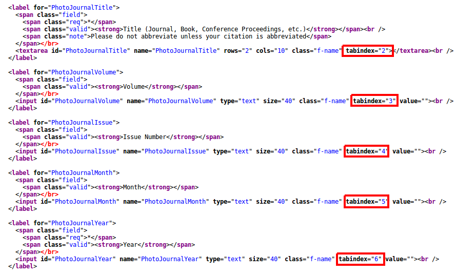

# ILLiad Citation Parser & DOI Resolver

# Work in progress! Using this in your web pages is not currently advisable.

This is a quick guide to help you add a citation parser / DOI resolver to your ILLiad article request forms. Setup requires only minimal knowledge of HTML.

## What does it do?

- Either parses a citation, or retrieves metadata associated with a DOI. If a citation contains a DOI, the DOI is used.
- Automatically fills out an ILLiad article or book chapter request form with the retrieved data.
- Checks openaccessbutton.org for an open access copy of the material, and displays a link to it if one is available.

You can try it out at <https://austinfsmith.github.io/ILL-Citation-Parser/parser.html>

## Setup Instructions

1. Find the main directory for your ILLiad web pages. This is the directory that contains ILLiadMainMenu.html, ArticleRequest.html, etc.
2. Create a folder called "js" in that directory, and save a copy of [DOIResolver.js](https://github.com/austinfsmith/ILL-DOI-Resolver/blob/master/DOIResolver.js) in that folder.
3. Open ArticleRequest.html, or any other form you'd like to add the resolver to. I strongly suggest saving a backup copy of this page before you make any changes, just in case.
4. Add the following line to your file, below the `<head>` line but above the `</head>` line. If the file already contains `<script>` lines, place it immediately after those.

    ```
	<script src="https://unpkg.com/xregexp/xregexp-all.js"></script>
	<script type="text/javascript" src="js/citationParser.js"></script>
    ```
5. If your form has a DOI field, you'll probably want to remove it. If you still want the DOI to be imported into ILLiad, you can add a hidden DOI field:

```
<input id="DOI" name="DOI" type="hidden" value="<#PARAM name="DOI">">
```
6. Next, you'll need to add a new field for the user to enter citations & DOIs into. It should most likely go near the top of the form - below the `<fieldset>` line, but above the first `<label for=...>` line.

```
<label for="citation_field">
  <span class="field">
    <span class="valid"><strong>Citation or DOI</strong></span><br />
  </span></br>
  <textarea id="citation-field" type="text" rows="4" class="f-name" tabindex="1" value=""></textarea>
  <button type="button" id="citation_button" onclick="ParseCitation()">Autofill</button><br />
  <div id="openaccessdiv" style="display:none"><br/>
    <button type="button" id="openaccessbutton">View Open Access Version</button><br/>
    <span class="note">Open Access versions may be author drafts.</span>
  </div>
</label>
```
7. Now you'll need to go through each of the fields defined on your form and change the tab indexes, so that users will be able to tab through the form in order. Look for the lines with `<input>` tags, and change the `tabindex` values to reflect the new order of the fields. Make sure to enclose the numbers in quotes.

8. Save your changes and try it out! The Autofill button should now be present & functional on your request form.

The code provided here has minimal styling; if you've modified the CSS for your ILLiad web pages, you'll probably want to tweak this to match your existing styles.


Please let me know if you decide to use this, or if you have any questions for comments!

